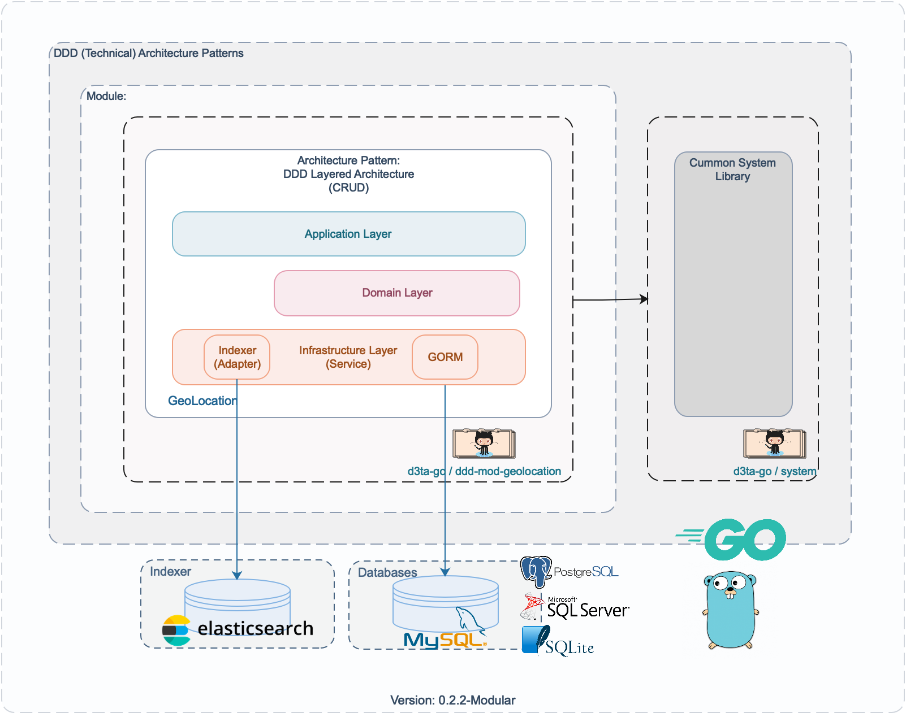
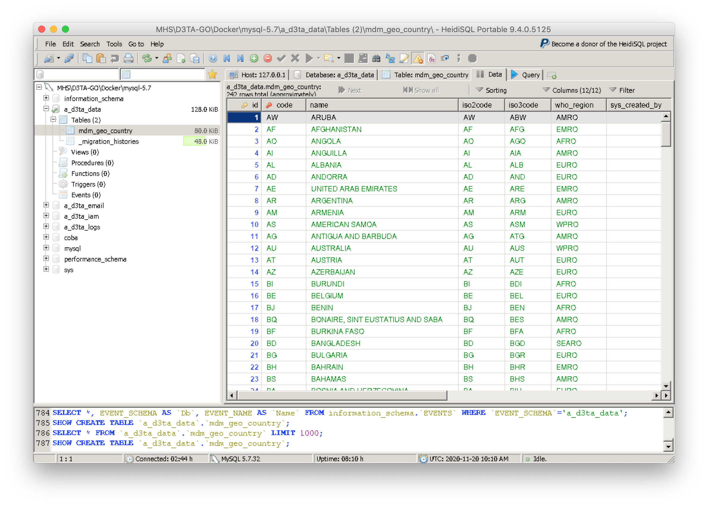
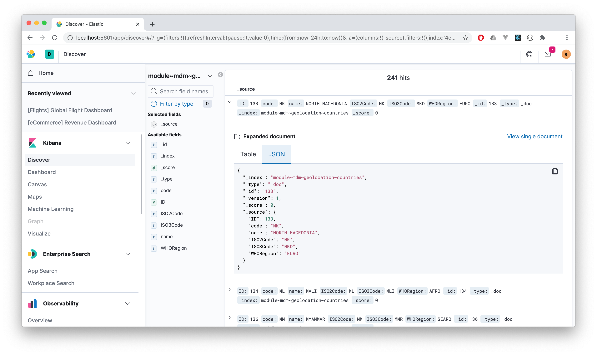

# ddd-mod-geolocation ( [](https://goreportcard.com/report/github.com/d3ta-go/ddd-mod-geolocation) )


DDD Module: GeoLocation (Supporting Subdomain)

As a part of `Simple Implementation of Modular DDD Technical Architecture Patterns in Go`.

## Diagram v 0.2.2-Modular



## Components

A. Interface Layer (None)

B. DDD Modules:

1. Geolocation - using DDD Layered Architecture Pattern (CRUD-GORM) [ [d3ta-go/ddd-mod-geolocation](https://github.com/d3ta-go/ddd-mod-geolocation) ]

C. Common System Libraries [ [d3ta-go/system](https://github.com/d3ta-go/system) ]:

1. Configuration - using yaml
2. Identity & Securities - using JWT, Casbin (RBAC)
3. Initializer
4. Email Sender - using SMTP
5. Handler
6. Migrations
7. Utils

D. Databases

1. MySQL (tested)
2. PostgreSQL (untested)
3. SQLServer (untested)
4. SQLite3 (untested)

F. Persistent Caches

1. Session/Token/JWT Cache (Redis, File, DB, etc) [tested: Redis]
2. Indexer/Search Cache (ElasticSearch)

G. Messaging [to-do]

H. Logs [to-do]

### Development

**1. Clone**

```shell
$ git clone https://github.com/d3ta-go/ddd-mod-geolocation.git
```

**2. Setup**

```
a. copy `conf/config-sample.yaml` to `conf/config.yaml`
b. copy `conf/data/test-data-sample.yaml` to `conf/data/test-data.yaml`
c. setup your dependencies/requirements (e.g: database, redis, smtp, etc.)
```

**3. Runing TDD on Development Stage**

3.1. TDD: DB Migration Test

```shell
$ cd ddd-mod-geolocation
$ sh tdd/clean-testcache.sh

$ sh tdd/ut.db.migration.run-001.sh

$ sh tdd/ut.db.migration.rollback-001.sh
```

3.2. TDD: Functionality Test (unit test)

```shell
$ cd ddd-mod-geolocation
$ sh tdd/clean-testcache.sh

$ sh tdd/ut.db.migration.run-001.sh

$ sh tdd/ut.pkg.infra-layer.svc.rdbms-001.sh

$ sh tdd/ut.pkg.infra-layer.svc.indexer-001.sh

$ sh tdd/ut.pkg.app-layer.service-001.sh

$ sh tdd/ut.pkg.app-layer.application-001.sh
```

OR

```shell
$ cd ddd-mod-geolocation
$ sh tdd/run.tdd.sh
```

**TDD Result Sample:**

- MySQL Database:



- ElasticSearch:


